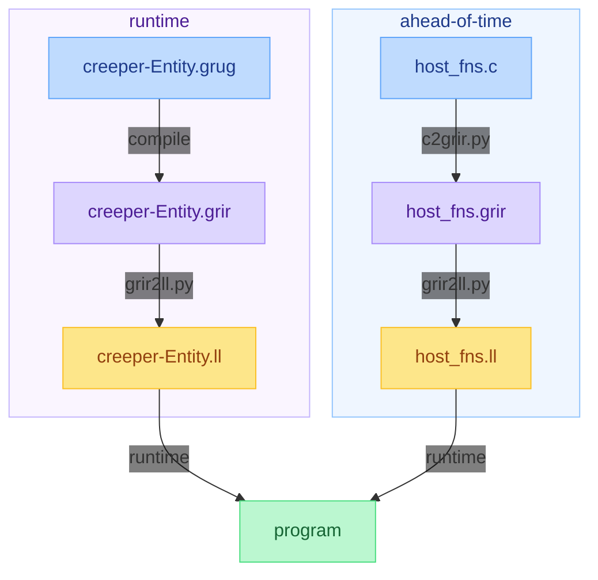

# grug IR

This [grug](https://github.com/grug-lang/grug) repository demonstrates:
1. How grug can be compiled to grug IR, and how that can easily be transpiled to LLVM IR.
2. How simple host functions in any language can be compiled to grug IR followed by LLVM IR *ahead of time*. That LLVM IR is loaded *at runtime*. This makes host functions inlinable intrinsics when compiling grug files, which gives grug a massive performance edge over lots of other languages that can't get rid of FFI overhead from constant host↔mod context switching.



## Simple grug IR example

The `tests/minmax/` directory serves as the canonical example of how host functions and grug code interoperate.
```
tests/minmax
├── creeper-Entity.grug
├── expected
│   ├── creeper-Entity.grir
│   ├── creeper-Entity.ll
│   ├── host_fns.grir
│   ├── host_fns.ll
│   └── mods.ll
└── host_fns.c
```

This setup demonstrates how the `host_fns.c` file is compiled to grug IR (`.grir`) using `c2grir.py`.

The `host_fns.c` file provides:
```c
double min(double a, double b) {
    return a < b ? a : b;
}

double max(double a, double b) {
    return a > b ? a : b;
}

void assert(bool condition) {
    if (!condition) {
        assert_failed();
    }
}
```

Running `c2grir.py` produces `expected/host_fns.grir`:
```
host min(a: number, b: number) number
    if a >= b goto L1
    return a
L1:
    return b

host max(a: number, b: number) number
    if a <= b goto L2
    return a
L2:
    return b

host assert(condition: bool)
    if condition != 0 goto L3
    call assert_failed
L3:
    return
```

## Complex grug IR example

Grug IR uses a [Three-Address Code](https://en.wikipedia.org/wiki/Three-address_code) format that handles function calls, arguments, and variable assignment. When `compile_grug.py` processes grug code, it flattens expressions into `arg` instructions followed by a `call` instruction.

Given this grug code in `tests/minmax/creeper-Entity.grug`:
```py
export tick() {
    assert(min(10, 5) == 5)
    assert(max(10, 5) == 10)
}
```

`compile_grug.py` generates the following `.grir` representation, found in `tests/minmax/expected/creeper-Entity.grir`:
```
export tick()
    arg 10
    arg 5
    t1: number = call min

    t2: bool = t1 == 5
    arg t2
    call assert

    arg 10
    arg 5
    t3: number = call max

    t4: bool = t3 == 10
    arg t4
    call assert

    return
```

This format ensures that arguments are pushed onto the stack via `arg` before invoking the function, and return values are captured into temporary variables (e.g., `t1`, `t3`) when necessary for further operations.

## Running `tests.py`

This will require you to have Clang and Clang's [FileCheck](https://llvm.org/docs/CommandGuide/FileCheck.html) installed:
1. Run `pip install pycparser==2.21 pycparser-fake-libc==2.21 coverage==7.2.7`
2. Run `rm -f .coverage && python tests.py && coverage report -m --fail-under=100`

## Pre-commit hooks (recommended)

### Install pre-commit

```bash
pip install pre-commit
pre-commit install
```

### Run manually

```bash
pre-commit run --all-files
```

## TODO

Here is the high-level plan for grug-lang/grug-ir, which can be split into small issues later:
- `.grir` (grug IR) is the textual representation of `.grbc`
- `.grbc` (grug bitcode) is the binary representation of `.grir`
- They are [TAC](https://en.wikipedia.org/wiki/Three-address_code), but I am leaning towards *no* [SSA form](https://en.wikipedia.org/wiki/Static_single-assignment_form), since [phi nodes](https://en.wikipedia.org/wiki/Static_single-assignment_form#Converting_to_SSA) are extra complexity that backends can [just deduce](https://en.wikipedia.org/wiki/Static_single-assignment_form#Computing_minimal_SSA_using_dominance_frontiers)
  - *Real* optimizers like LLVM also still lower `.bc` to target-specific [`.mir`](https://llvm.org/docs/MIRLangRef.html), so `.grbc` isn't the lowest IR anyways
  - Keeping the IR simple means we won't have to additionally pass the AST node struct pointers anymore to simple backends
- Let grug-ir transpile all tests in grug-tests to `.grir`, and let it test `.grir` -> `.grbc` -> `.grir` is lossless for all of them
  - This will require `grir2grbc.py` and `grbc2grir.py`
  - This is unlike LLVM, where `.ll` -> `.bc` -> `.ll` is lossy, which meant they had to write [llvm-diff](https://llvm.org/docs/CommandGuide/llvm-diff.html)
  - Similar to [`grug-tests/grug_grammar.lark`](https://github.com/grug-lang/grug-tests/blob/main/grug_grammar.lark), `grir_grammar.lark` must successfully parse all `.grir` files in CI
  - Similar to `.grug`, I propose that whitespace should be part of `.grir` its grammar
    - Unlike `.grug`, comments and empty lines won't be allowed, since `.grir` isn't meant to be written by hand
- Add `grug_compiler.py` to compile `.grug` to `.grbc`
  - Similar to [`grug-tests/grug_grammar.py`](https://github.com/grug-lang/grug-tests/blob/main/grug_grammar.py) it would read `grir_grammar.lark`
- Add `grbc2ll.py` to convert `.grbc` to `.ll`
- Add `c2grbc.py` to convert `.c` to `.grbc`
  - It would depend on a popular Python package for parsing, like [pycparser](https://github.com/eliben/pycparser)
  - It would only support a strict subset of C that fits within grug's simple IR goal
  - People could fork `c2grbc.py` to write say `cpp2grbc.py` and `py2grbc.py`, which we would link in grug-ir's readme
  - This will allow grug backends to _fully_ inline tons of modding API host functions (intrinsics), without writing `.grir` by hand
    - This will be especially impactful for data structures like `List` and `Dict`, since grug has no built-in data structures
    - LuaJIT and WASM don't have this!
- Let CI test that `grbc_interpreter.py` passes all relevant tests in grug-tests (for example, hot reloading tests are not relevant)
  - Let `grbc_interpreter.py` first transform the `.grbc` into SSA form, to ensure the TAC format doesn't make it too hard
- Let grug-ir have its own `.c` microbenchmarks, with a `.grug` version for each of them
  - Let CI test that `.grug`->`.grbc`->`.ll`->`a.out` is never more than 5% slower than `.c`->`.ll`->`a.out`
    - Benchmarking has been my specialization for over a year now at AMD, so I can help with lowering noise below 5%
  - Let CI automatically update their benchmark graphs in the readme, similar to [grug-for-lua's graphs](https://github.com/grug-lang/grug-for-lua#benchmarks)
- Add a C microbenchmark that runs fast as a result of a pragma, or something like specifying alignment
  - `.grir` and `.grbc` may store `align` as an optimization hint that grug implementations are free to ignore
  - `.grir` and `.grbc` _won't_ store `restrict` on pointers, as that was a hint to the _compiler_
- Note that generics are just for the frontend to perform type-checking, so `List[number]` will be stored as a `u64` ID
- Just like grug-for-python, all scripts in grug-ir must pass Python's [Black](https://github.com/psf/black) formatter, pass all [pyright](https://github.com/microsoft/pyright) type checks, keep 100% coverage with [coverage.py](https://github.com/coveragepy/coveragepy), have no dependencies, and support >= Python 3.7
