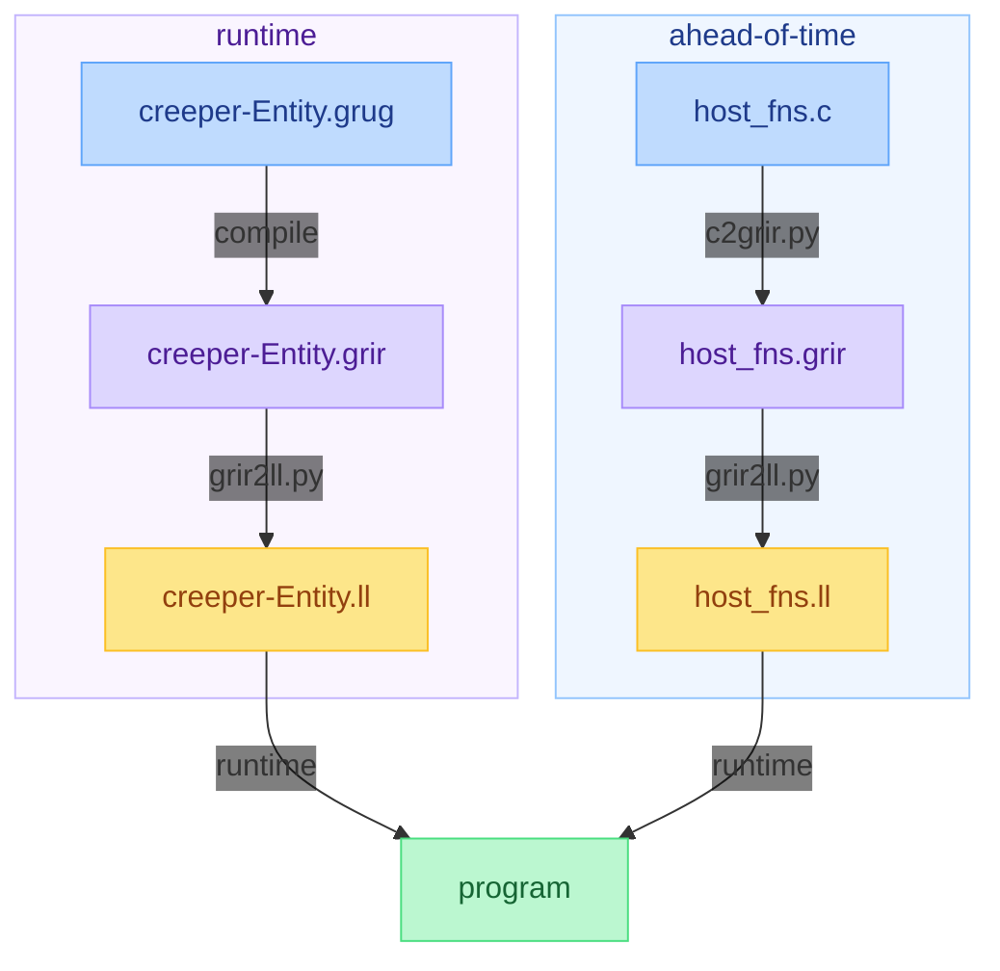

# grug IR

This [grug](https://github.com/grug-lang/grug) repository demonstrates:
1. How grug can be compiled to grug IR, and how that can easily be transpiled to LLVM IR.
2. How simple host functions in any language can be compiled to grug IR followed by LLVM IR *ahead of time*. That LLVM IR is loaded *at runtime*. This makes host functions inlinable intrinsics when compiling grug files, which gives grug a massive performance edge over lots of other languages that can't get rid of FFI overhead from constant host↔mod context switching.



## Architecture & Design Principles

* **Human Readability Over Strict TAC:** The `.grir` (grug IR) representation moves away from strict [Three-Address Code](https://en.wikipedia.org/wiki/Three-address_code) (TAC) in favor of increased human readability. By allowing variables and constant arguments to be passed directly within the function call (e.g., `t1: number = min(10, 5)`, known as [ANF](https://en.wikipedia.org/wiki/A-normal_form)) instead of using stack pushes, the format remains linear while staying highly intuitive. This atomic argument structure eliminates the need for recursive descent parsing in the compiler backend.
* **Generic Storage:** Generics exist strictly for the frontend to perform type-checking. During compilation to `.grir` and `.grbc` (grug bitcode), generic types such as `List[number]` are simplified and stored explicitly as `u64` IDs rather than complex structures.
* **No SSA Form:** The IR avoids Static Single-Assignment (SSA) form, as phi nodes introduce extra complexity that backends can just deduce. Keeping the IR simple ensures we don't have to pass AST node struct pointers to simple backends.

## Simple grug IR example

The `tests/minmax/` directory serves as the canonical example of how host functions and grug code interoperate:
```
tests/minmax
├── creeper-Entity.grug
├── expected
│   ├── creeper-Entity.grir
│   ├── creeper-Entity.ll
│   ├── host_fns.grir
│   ├── host_fns.ll
│   └── mods.ll
└── host_fns.c
```

This setup demonstrates how the `host_fns.c` file is compiled to grug IR (`.grir`) using `c2grir.py`.

The `host_fns.c` file provides:
```c
double min(double a, double b) {
    return a < b ? a : b;
}

double max(double a, double b) {
    return a > b ? a : b;
}

void assert(bool condition) {
    if (!condition) {
        assert_failed();
    }
}
```

Running `c2grir.py` produces `expected/host_fns.grir`:
```
host min(a: number, b: number) number
    if a >= b goto L1
    return a
L1:
    return b

host max(a: number, b: number) number
    if a <= b goto L2
    return a
L2:
    return b

host assert(condition: bool)
    if condition != 0 goto L3
    assert_failed()
L3:
    return
```

## Complex grug IR example

When `compile_grug.py` processes grug code, it flattens complex logic into a sequence of straightforward assignments, where each line performs exactly one operation.

Given this grug code in `tests/minmax/creeper-Entity.grug`:
```py
export tick() {
    assert(min(10, 5) == 5)
    assert(max(10, 5) == 10)
}
```

`compile_grug.py` generates the following `.grir` representation, found in `tests/minmax/expected/creeper-Entity.grir`:
```
export tick()
    t1: number = min(10, 5)

    t2: bool = t1 == 5
    assert(t2)

    t3: number = max(10, 5)

    t4: bool = t3 == 10
    assert(t4)
```

This format ensures that function calls are natively formatted, and return values are captured into temporary variables (e.g., `t1`, `t3`) when necessary for further operations.

## Running `tests.py`

This will require you to have Clang and Clang's [FileCheck](https://llvm.org/docs/CommandGuide/FileCheck.html) installed:
1. Run `pip install pycparser==2.21 pycparser-fake-libc==2.21 coverage==7.2.7`
2. Run `rm -f .coverage && python tests.py && coverage report -m --fail-under=100`

## Pre-commit hooks (recommended)

### Install pre-commit

```bash
pip install pre-commit
pre-commit install
```

### Run manually

```bash
pre-commit run --all-files
```

## Issue Tracking & Project Plan

All planned features, architecture rewrites, and CI pipeline enhancements for grug IR are tracked in the repository's [GitHub Issues](https://github.com/grug-lang/grug-ir/issues).
