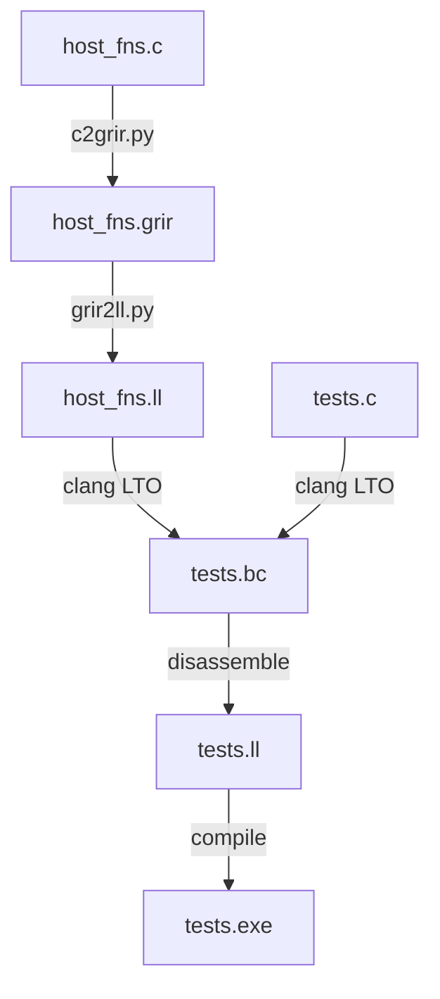

# grug IR

This [grug](https://github.com/grug-lang/grug) repository demonstrates:
1. How grug can be compiled to grug IR, and how that can easily be transpiled to LLVM IR.
2. How simple host functions in any language can be compiled to grug IR *ahead of time* and then transpiled to LLVM IR *at runtime*. This lets FFI overhead completely vanish by allowing host function calls to be inlined.



## Simple grug IR example

Here is the layout of `tests/minmax/`:
```
tests/minmax
├── expected
│   ├── host_fns.grir
│   ├── host_fns.ll
│   └── tests.ll
├── host_fns.c
└── tests.c
```

It proves that these host functions in `host_fns.c`:
```c
double min(double a, double b) {
    return a < b ? a : b;
}

double max(double a, double b) {
    return a > b ? a : b;
}
```

Which are tested using `assert()` calls in `tests.c`:
```c
#include <assert.h>
#include <stdio.h>

// Declare the host functions
extern double min(double a, double b);
extern double max(double a, double b);

int main() {
    // Test min()
    assert(min(5.0, 10.0) == 5.0);
    assert(min(10.0, 5.0) == 5.0);
    assert(min(3.14, 3.14) == 3.14);

    // Test max()
    assert(max(5.0, 10.0) == 10.0);
    assert(max(10.0, 5.0) == 10.0);
    assert(max(3.14, 3.14) == 3.14);

    printf("All host function assertions passed successfully!\n");
}
```

Successfully get optimized away in `expected/tests.ll`, where only the `printf` (`puts`) and implicit `return 0;` remain:
```ll
; CHECK-LABEL: define dso_local noundef i32 @main
; CHECK-NEXT:  {{%[0-9]+}} = tail call i32 @puts(ptr nonnull dereferenceable(1) @str)
; CHECK-NEXT:  ret i32 0
; CHECK-NEXT: }
```

Simple host functions can be written in any language; `c2grir.py` compiles `host_fns.c` to `expected/host_fns.grir`:
```
host_fn min
param a number
param b number
returns number
if a >= b goto L1
ret a
L1:
ret b
host_fn max
param a number
param b number
returns number
if a <= b goto L2
ret a
L2:
ret b
```

The script `grir2ll.py` turns it into the LLVM IR `expected/host_fns.ll`, but you can easily modify it to target other popular IRs:
```ll
define double @min(double %a, double %b) {
entry:
  %cmp0 = fcmp oge double %a, %b
  br i1 %cmp0, label %L1, label %fallthrough0

fallthrough0:
  ret double %a

L1:
  ret double %b
}

define double @max(double %a, double %b) {
entry:
  %cmp0 = fcmp ole double %a, %b
  br i1 %cmp0, label %L2, label %fallthrough0

fallthrough0:
  ret double %a

L2:
  ret double %b
}
```

## Complex grug IR example

If we value human readability (infix notation) over simplicity (prefix notation) for `.grir`, this function from the grug readme's [example fibonacci program](https://github.com/grug-lang/grug/blob/main/README.md#example):
```py
local _fib_list(n: number) List[number] {
    fib_list: List[number] = List()

    memo: Dict[number, number] = Dict()

    i: number = 0
    while i < n {
        fib_list.append(_fib(i, memo))
        i = i + 1
    }

    return fib_list
}
```

Will be compiled to this `.grir` file:
```
local_fn _fib_list
param n number
returns id
local fib_list id
local memo id
local i number
local t1 id
fib_list = call List
memo = call Dict
i = 0
L1:
if i >= n goto L2
arg i
arg memo
t1 = call _fib
arg fib_list
arg t1
call List_append
i = i + 1
goto L1
L2:
ret fib_list
```

## Running `tests.py`

This will require you to have Clang and Clang's [FileCheck](https://llvm.org/docs/CommandGuide/FileCheck.html) installed:
1. Run `pip install pycparser==2.22`
2. Run `python tests.py`

## Pre-commit hooks (recommended)

### Install pre-commit

```bash
pip install pre-commit
pre-commit install
```

### Run manually

```bash
pre-commit run --all-files
```

## TODO

Here is the high-level plan for grug-lang/grug-ir, which can be split into small issues later:
- `.grir` (grug IR) is the textual representation of `.grbc`
- `.grbc` (grug bitcode) is the binary representation of `.grir`
- They are [TAC](https://en.wikipedia.org/wiki/Three-address_code), but I am leaning towards *no* [SSA form](https://en.wikipedia.org/wiki/Static_single-assignment_form), since [phi nodes](https://en.wikipedia.org/wiki/Static_single-assignment_form#Converting_to_SSA) are extra complexity that backends can [just deduce](https://en.wikipedia.org/wiki/Static_single-assignment_form#Computing_minimal_SSA_using_dominance_frontiers)
  - *Real* optimizers like LLVM also still lower `.bc` to target-specific [`.mir`](https://llvm.org/docs/MIRLangRef.html), so `.grbc` isn't the lowest IR anyways
  - Keeping the IR simple means we won't have to additionally pass the AST node struct pointers anymore to simple backends
- Let grug-ir transpile all tests in grug-tests to `.grir`, and let it test `.grir` -> `.grbc` -> `.grir` is lossless for all of them
  - This will require `grir2grbc.py` and `grbc2grir.py`
  - This is unlike LLVM, where `.ll` -> `.bc` -> `.ll` is lossy, which meant they had to write [llvm-diff](https://llvm.org/docs/CommandGuide/llvm-diff.html)
  - Similar to [`grug-tests/grug_grammar.lark`](https://github.com/grug-lang/grug-tests/blob/main/grug_grammar.lark), `grir_grammar.lark` must successfully parse all `.grir` files in CI
  - Similar to `.grug`, I propose that whitespace should be part of `.grir` its grammar
    - Unlike `.grug`, comments and empty lines won't be allowed, since `.grir` isn't meant to be written by hand
- Add `grug_compiler.py` to compile `.grug` to `.grbc`
  - Similar to [`grug-tests/grug_grammar.py`](https://github.com/grug-lang/grug-tests/blob/main/grug_grammar.py) it would read `grir_grammar.lark`
- Add `grbc2ll.py` to convert `.grbc` to `.ll`
- Add `c2grbc.py` to convert `.c` to `.grbc`
  - It would depend on a popular Python package for parsing, like [pycparser](https://github.com/eliben/pycparser)
  - It would only support a strict subset of C that fits within grug's simple IR goal
  - People could fork `c2grbc.py` to write say `cpp2grbc.py` and `py2grbc.py`, which we would link in grug-ir's readme
  - This will allow grug backends to _fully_ inline tons of modding API host functions (intrinsics), without writing `.grir` by hand
    - This will be especially impactful for data structures like `List` and `Dict`, since grug has no built-in data structures
    - LuaJIT and WASM don't have this!
- Let CI test that `grbc_interpreter.py` passes all relevant tests in grug-tests (for example, hot reloading tests are not relevant)
  - Let `grbc_interpreter.py` first transform the `.grbc` into SSA form, to ensure the TAC format doesn't make it too hard
- Let grug-ir have its own `.c` microbenchmarks, with a `.grug` version for each of them
  - Let CI test that `.grug`->`.grbc`->`.ll`->`a.out` is never more than 5% slower than `.c`->`.ll`->`a.out`
    - Benchmarking has been my specialization for over a year now at AMD, so I can help with lowering noise below 5%
  - Let CI automatically update their benchmark graphs in the readme, similar to [grug-for-lua's graphs](https://github.com/grug-lang/grug-for-lua#benchmarks)
- Add a C microbenchmark that runs fast as a result of a pragma, or something like specifying alignment
  - `.grir` and `.grbc` may store `align` as an optimization hint that grug implementations are free to ignore
  - `.grir` and `.grbc` _won't_ store `restrict` on pointers, as that was a hint to the _compiler_
- Note that generics are just for the frontend to perform type-checking, so `List[number]` will be stored as a `u64` ID
- Just like grug-for-python, all scripts in grug-ir must pass Python's [Black](https://github.com/psf/black) formatter, pass all [pyright](https://github.com/microsoft/pyright) type checks, keep 100% coverage with [coverage.py](https://github.com/coveragepy/coveragepy), have no dependencies, and support >= Python 3.7
