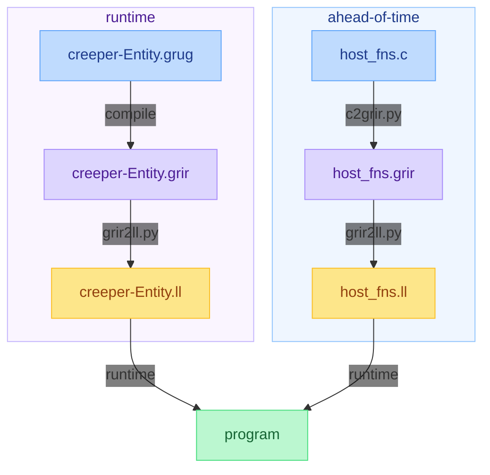

# grug IR

This [grug](https://github.com/grug-lang/grug) repository demonstrates how:

1. grug can be compiled to grug IR, and how grug IR can easily be transpiled to LLVM IR.
2. Simple host functions, written in any language, can be compiled to grug IR and then LLVM IR *ahead of time*. Since this LLVM IR is loaded *at runtime*, these host functions become inlinable intrinsics when compiling grug files. This provides grug with a significant performance advantage over lots of other languages that can't get rid of FFI overhead from constant host↔mod context switching. grug-ir's CI also verifies across all benchmarks that `C → LLVM IR` and `C → grug IR → LLVM IR` remain within 5% performance of each other.
3. `grir2ll.py` is intentionally simple and can be easily rewritten to target other IRs or bytecode formats. Many games do not want the size and complexity of embedding LLVM, so grug IR is designed to stay lightweight and backend-agnostic.



## Architecture & Design Principles

* **Human Readability Over Strict TAC:** The `.grir` (grug IR) representation moves away from strict [Three-Address Code](https://en.wikipedia.org/wiki/Three-address_code) (TAC) to prioritize human readability. By allowing variables and constant arguments to be passed directly within function calls (e.g., `t1: number = min(10, 5)`, known as [ANF](https://en.wikipedia.org/wiki/A-normal_form)) rather than utilizing stack pushes, the format remains linear and intuitive. This atomic argument structure eliminates the need for recursive descent parsing in the compiler backend.
* **Generic Storage:** Generics exist solely for the frontend to perform type-checking. During compilation to `.grir` and `.grbc` (grug bitcode), generic types such as `List[number]` are simplified and stored explicitly as `u64` IDs rather than as complex structures.
* **No SSA Form:** The IR avoids [Static Single-Assignment](https://en.wikipedia.org/wiki/Static_single-assignment_form) (SSA) form, as phi nodes introduce complexity that backends can deduce independently. Keeping the IR simple ensures we do not need to pass AST node struct pointers to simple backends.

## Example

The `tests/minmax/` directory demonstrates how host functions are inlined into grug code:
```
tests/minmax
├── expected
│   ├── creeper-Entity.grir
│   ├── creeper-Entity.ll
│   ├── host_fns.grir
│   ├── host_fns.ll
│   └── mods.ll
├── creeper-Entity.grug
└── host_fns.c
```

Here is `tests/minmax/creeper-Entity.grug`:
```rs
export tick() {
    assert(min(10, 5) == 5)
    assert(max(10, 5) == 10)
}
```

Running `compile_grug.py` outputs this `tests/minmax/.output/creeper-Entity.grir`:
```rs
export tick()
    t1: number = min(10, 5)

    t2: bool = t1 == 5
    assert(t2)

    t3: number = max(10, 5)

    t4: bool = t3 == 10
    assert(t4)
```

Here is `tests/minmax/host_fns.c`:
```c
double min(double a, double b) {
    return a < b ? a : b;
}

double max(double a, double b) {
    return a > b ? a : b;
}

void assert(bool condition) {
    if (!condition) {
        assert_failed();
    }
}
```

Running `c2grir.py` outputs this `tests/minmax/.output/host_fns.grir`:
```rs
host min(a: number, b: number) number
    if a >= b goto L1
    return a
L1:
    return b

host max(a: number, b: number) number
    if a <= b goto L2
    return a
L2:
    return b

host assert(condition: bool)
    if condition != 0 goto L3
    assert_failed()
L3:
    return
```

The `program.c` file at the root of the repository merges `creeper-Entity.ll` with `host_fns.ll` at runtime using LLVM's C API. The file `tests/minmax/expected/mods.ll` uses [FileCheck](https://llvm.org/docs/CommandGuide/FileCheck.html) to verify that LLVM successfully optimized the asserts in `creeper-Entity.grug` away, confirming they always hold true:
```ll
define void @tick() local_unnamed_addr #0 {
assert.exit2:
  ret void
}
```

## Running `tests.py`

This requires you to have Clang and Clang's [FileCheck](https://llvm.org/docs/CommandGuide/FileCheck.html) installed:
1. Run `pip install pycparser==2.21 pycparser-fake-libc==2.21 coverage==7.2.7`
2. Run `rm -f .coverage && python tests.py && coverage report -m --fail-under=100`

## Pre-commit hooks (recommended)

The file `.pre-commit-config.yaml` is a [pre-commit hook](https://pre-commit.com/), which is set up to run the Python formatters [Black](https://github.com/psf/black) and [pyright](https://github.com/RobertCraigie/pyright-python) on every commit.

### Install pre-commit

```bash
pip install pre-commit
pre-commit install
```

### Run manually

```bash
pre-commit run --all-files
```

## Issue Tracking & Project Plan

See the repository's [Issues](https://github.com/grug-lang/grug-ir/issues) tab.
